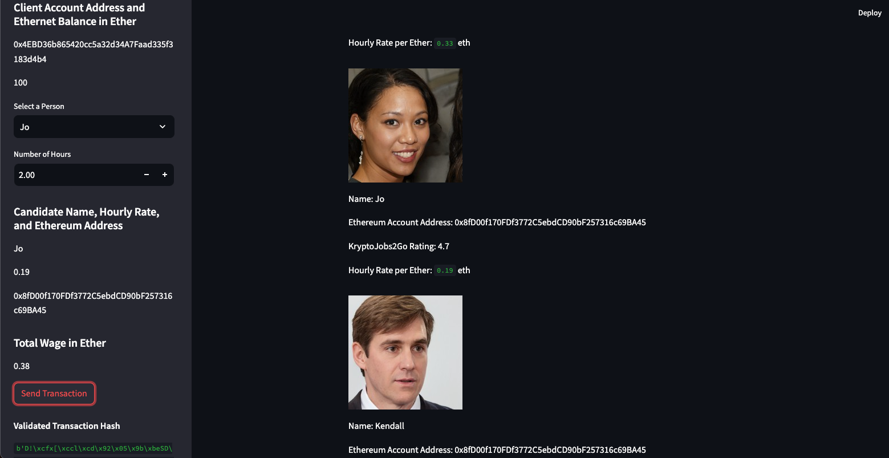
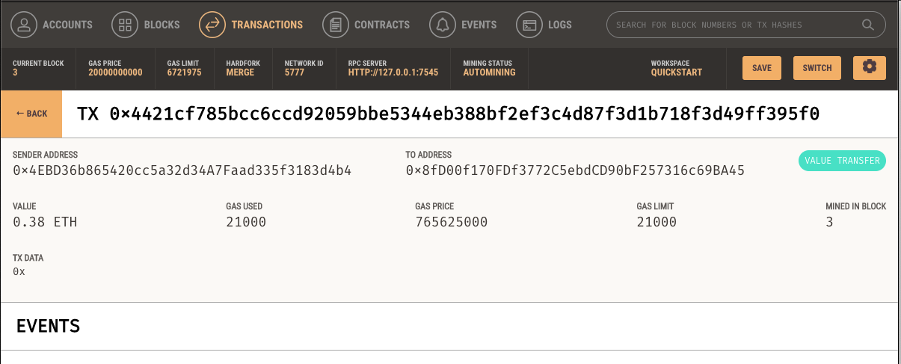
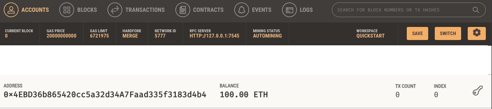
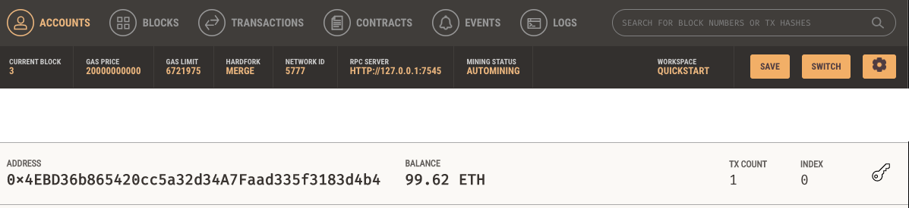

# KryptoJobs2Go - Blockchain-Powered Hiring

 This project leverages the power of the Ethereum blockchain to enable instant cryptocurrency payments to hired candidates. Below are the key components and steps involved in integrating Ethereum transactions into the KryptoJobs2Go application.

## Project Overview

### Features

Find and Hire Professionals: Users can browse a list of fintech candidates and hire them for specific tasks.
Instant Payments: Integrated with the Ethereum blockchain, the app facilitates immediate cryptocurrency payments.
Streamlined User Interface: Built with Streamlit, the application provides an intuitive and seamless user experience.

- **Find and Hire Professionals**: Users can browse a list of fintech candidates and hire them for specific tasks.
- **Instant Payments**: Integrated with the Ethereum blockchain, the app facilitates immediate cryptocurrency payments.
- **Streamlined User Interface**: Built with Streamlit, the application provides an intuitive and seamless user experience.

### Tech Stack

- **Ethereum Blockchain**: For secure and instant cryptocurrency transactions.
- **Python**: The core programming language used for backend development.
- **Web3**: A Python library for connecting to and performing operations on Ethereum-based blockchains.
- **Streamlit**: A library used for creating the web interface.
- **Ganache**: A personal blockchain for Ethereum development, used for testing transactions.

## Installation and Setup

### Prerequisites

- Python 3.7 or above
- Web3
- Ganache
- Streamlit
- Ethereum Wallet

### Files

- `fintech_finder.py`: Contains the main application code, integrated with Streamlit.
- `crypto_wallet.py`: A module with functions for Ethereum transactions.
- `.env`: Contains the mnemonic seed phrase for the Ethereum wallet.

### Key Components and Steps

#### 1. Import Ethereum Transaction Functions
- Imported functions from crypto_wallet.py:
- generate_account
-  get_balance
- send_transaction
- Created an Ethereum account and displayed the account balance in the Streamlit sidebar.
#### 2. Sign and Run a Payment Transaction

- Calculated the wage for a candidate based on their hourly rate and the number of hours worked.
- Implemented a transaction mechanism to send Ethereum payments to hired candidates.
- Displayed transaction details, including the transaction hash, in the web interface.
#### 3. Inspect the Transaction in Ganache

- Sent a test transaction using the web interface.
- Verified the transaction details in Ganache.
- Included screenshots of the transaction history and balances.

# Screenshots

### Validated Transaction Hash

### Transaction in Ganache

### Account Balance and History

#### Before

#### After

# Conclusion
KryptoJobs2Go demonstrates how blockchain technology can streamline the hiring and payment processes for fintech professionals. By integrating Ethereum transactions, the application ensures secure, transparent, and instant payments, providing a significant advantage over traditional payment methods.

